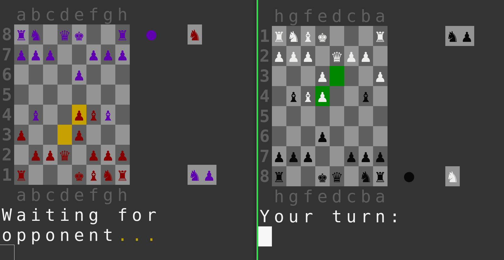

# CLI CHESS / Command line based Chess with Python



# What is it?
This is the cutest Chess I have ever played in the command line.

# Why does it exist?
To play directly or use as a standalone basic chess engine

# What it allows to do
. playing chess using 1 or 2 player  
. customize styling of cells and pieces separately for each player  
. identify checks and checkmates  
. Handling special cases like En passant and Castling  
. Loading written chess games using their chess notations  

# How to install?
If you plan to just Play it, the only requirement will be rich for nice UI
```bash
python3 -m pip install rich
```
If you would like to continue development and run tests, also some type of pgn parser would be beneficial for chess notation loading functionality, ex:
```bash
python3 -m pip install git+https://github.com/renatopp/pgnparser
```
# How it works?
Game logic is written entirely here, without using any external libraries. Main technical starting point is Board object in board.py file, that allows to initialize empty game and apply moves one by one for specific players if possible, and if not, get specific error types that can be shown to users. It should be pretty easy to reuse the main components from this library to your project and maybe just change how input is received and the board drawn and you should have remaining functionality for free. For more information please look at files in testing folder and at least the board.py and pieces.py files.

# performance
Game is not specifically optimized for speed in any ways, but for its main usage, it was fast enough to play without any issues. When loading games using their chess notations, it may take few seconds as before each move, first we make sure that it is valid for given configuration.


# Input format
Currently Board object allows to read chess notations directly, like Nf3 or Bxc3, but as this type of notation is a bit harder to read and write, I mainly use notation that I call basic notation, which is just starting cell and ending cell of moving piece. For example if you want to play Queen from d1 to d3, just type "d1 d3" (without quotes) and if this move is valid on current board configuration, it will be applied, otherwise invalid move error should be shown.


## Handling special types of moves
. Castling - You can just type queen positions before and after castling, or use short-long castle notations like O-O and O-O-O (Big letter O-s, not 0(zeros))  
. En passant - also same as castling, just type before and after locations, killing will be done if possible  
. Pawn promotion - example input: "e7 e8=Q", meaning go to last row and promote pawn to Queen. Instead of Q-ueen, you can also use R-ook, B-ishop or k-N-ight.  

# How to play?
### using 1 player
start test.py file and play with all possible arguments to see what is available

### using 2 players
In this case you need 2 files: player_1.py and player_2.py. 
1) start player_1.py, which will start game hosting and wait for connections. 
2) start player_2.py with same configuration of PORT and HOST as player_1.py is using
3) after running player_2.py, you should directly see boards drawn on both terminals and be able to make a move when it is your turn. For more info, please see these player_1/2.py files and let me know if something is not working for you. 

Game should be playable on same network devices, or different ones, given that you configure ports and hosts correctly and firewall or other software is not blocking access. Special thanks for nice solution for sockets part for Youtube channel [NeuralNine](https://www.youtube.com/watch?v=s6HOPw_5XuY)


## Currently Known bugs
Known for me - 0 , but of course there will most probably be some, so feel free to suggest corrections if needed

## Things that are not implemented
. Stalemate and draw - I think for now they were not necessary, but may be added in the future

## running tests
```bash
python -m unittest discover tests
```

## contribution
Feel free to contribute, but at first please test new feature thoroughly and add tests of most edge cases. Please use Black to format the code.

## license
MIT License

Copyright (c) [2022] [Tornike Skhulukhia]

Permission is hereby granted, free of charge, to any person obtaining a copy
of this software and associated documentation files (the "Software"), to deal
in the Software without restriction, including without limitation the rights
to use, copy, modify, merge, publish, distribute, sublicense, and/or sell
copies of the Software, and to permit persons to whom the Software is
furnished to do so, subject to the following conditions:

The above copyright notice and this permission notice shall be included in all
copies or substantial portions of the Software.

THE SOFTWARE IS PROVIDED "AS IS", WITHOUT WARRANTY OF ANY KIND, EXPRESS OR
IMPLIED, INCLUDING BUT NOT LIMITED TO THE WARRANTIES OF MERCHANTABILITY,
FITNESS FOR A PARTICULAR PURPOSE AND NONINFRINGEMENT. IN NO EVENT SHALL THE
AUTHORS OR COPYRIGHT HOLDERS BE LIABLE FOR ANY CLAIM, DAMAGES OR OTHER
LIABILITY, WHETHER IN AN ACTION OF CONTRACT, TORT OR OTHERWISE, ARISING FROM,
OUT OF OR IN CONNECTION WITH THE SOFTWARE OR THE USE OR OTHER DEALINGS IN THE
SOFTWARE.


# Some ideas that may be implemented later  
. Showing some kind of historical info like famous players that had similar situations during the game  
. do not stop game after 1 checkmate and add scoring  


# Warnings
. some colors may not work on some terminals, if it is the case for you, please try different one, or change the default colors used with one these: https://rich.readthedocs.io/en/stable/appendix/colors.html

